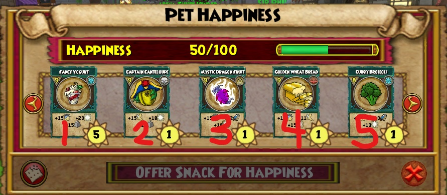

# Wizard101_DanceBot

This script runs an image classification algorithm to detect and identify the arrows on screen, and relays it back.

## Disclaimer

Although it is against the ToS to be botting and using a third-party software, since the script does not exploit any of the internal workings of the game, combined with the lack of anti bot detections from King Isle and difficulty to catch an external bot, this program should be relatively safe to use, but use it at your own discretion.

## Usage

Download the latest executable bundle in the releases [here](https://github.com/kennyhngo/Wizard101_DanceBot).

## Instructions

**Note: this has not been tested on the Steam version yet.**

1. Open the game and login.
1. Set your in-game settings as follows:
   * UI Size: HUGE
   * Fullscreen: OFF
1. Go to the Pet Dance game, wait near the spiral and do not open the minigame's menu.
1. Run the executable. Do not move it out of the folder.
1. Enter amount of games to play.

### Locations

Selecting a location adds that map to a random chance that the script will select it. For example, if you choose to play in Wizard City and Mooshu, then there is a 50% chance that the script will select either Wizard City or Mooshu.

### Snacks

Selecting a snack adds that snack choice to a random choice that the script will feed that snack to your pet (see visual below for a better explanation). If no snacks are chosen, then no snacks will the fed.

### Level Up

In the case that your pet levels up, you will have to manually force stop the program by pressing the `'q'` key.

## Bug/Issue Reporting

If you happen to run into any issues, please go to the [issues tab](https://github.com/kennyhngo/Wizard101_DanceBot/issues) and report it. Any video or image documentation, as well as your game client settings (and maybe operating system settings) will be very helpful. If you are able to reproduce the issue, feel free to document that as well. Furthermore, there should be a `crash.log` file that you may include to help me resolve your issue.
